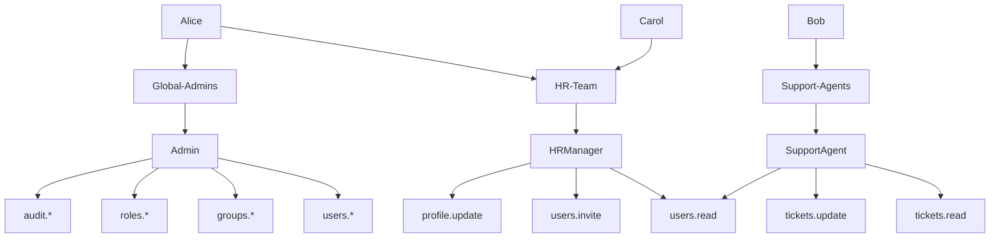

# IdentityHub: Full Project & Authorization Model Guide

---

# Project Overview

**IdentityHub** is an enterprise-grade authentication and authorization service that sits between Azure Entra ID and your applications, providing tenant-aware identity management, role-based access control (RBAC), and permission-based authorization.

## 🎯 Core Purpose

IdentityHub answers one critical question:

> **"Who is this user and what are they allowed to do?"**

It acts as an **integration and decision layer** on top of Azure Entra ID, providing:

- ✅ Centralized authentication via OIDC
- ✅ Role and permission-based authorization
- ✅ Multi-tenant identity management
- ✅ Graph API integration for user and group data
- ✅ Policy-driven access control
- ✅ Audit logging and compliance

---

# Architecture

```
┌─────────────┐
│ Application │
└──────┬──────┘
       │ "Can user X do Y?"
       ▼
┌─────────────────┐
│  IdentityHub    │ ← Authentication, Authorization, Policy Engine
└────────┬────────┘
         │
         ▼
┌─────────────────┐
│ Azure Entra ID  │ ← Identity Provider
│  + Graph API    │
└─────────────────┘
```

**What IdentityHub IS:**
- An authorization decision service
- A Graph API integration layer
- A tenant-aware permission resolver
- A policy evaluation engine

**What IdentityHub is NOT:**
- An identity provider (Entra ID handles that)
- A custom login system
- A password manager
- A replacement for Azure AD

---

# Features & Roadmap

## Phase 1: Core Identity & Authorization (MVP)
- Azure Entra ID login via OIDC
- JWT token validation and claims extraction
- Token-to-user context mapping
- Secure authentication pipeline
- Fetch user profiles from Microsoft Graph
- Retrieve group memberships
- Access assigned app roles
- Intelligent caching with short TTL for performance
- **Role-Based Access Control (RBAC)**: Admin, User, Viewer, etc.
- **Group-to-Role Mapping**: Entra ID groups → application roles
- **Policy-Based Authorization**: `[Authorize(Policy = "...")]`
- Clean separation between authentication and authorization logic
- Secured REST endpoints
- Proper HTTP status codes (401 Unauthorized vs 403 Forbidden)
- Clear permission boundaries
- Request validation and error handling
- Audit logging

## Phase 2: Enterprise-Grade Features
- Multi-Tenant Awareness
- App Roles + Group-Based Authorization
- Permission-Based Access (Fine-Grained)
- Admin API

## Phase 3: Advanced & Differentiating Features
- Policy Engine
- Managed Identity & Secretless Authentication
- Event-Driven Identity Synchronization
- Admin UI (Angular)

---

# Technology Stack

| Layer              | Technology                   |
| ------------------ | ---------------------------- |
| **Backend**        | .NET                         |
| **Authentication** | Azure Entra ID (OIDC, JWT)   |
| **Identity Data**  | Microsoft Graph API          |
| **Authorization**  | Policy-based + RBAC          |
| **Data Storage**   | Azure Cosmos DB / SQL Server |
| **Caching**        | Azure Redis Cache            |
| **Logging**        | Azure Application Insights   |
| **Identity**       | Azure Managed Identity       |
| **Frontend**       | Angular (Phase 3)            |

---

# Authorization Model Cheat Sheet

## Key Concepts

- **User**: An individual identity (from Entra ID/Azure AD). Users are not directly assigned roles or permissions.
- **Group**: An Entra ID group. Users are members of groups.
- **GroupRoleMapping**: Maps a group to a single application role. If a user is in a group, they get the mapped role.
- **Role**: A named set of permissions (e.g., Admin, User, Viewer). Roles are assigned to users via group membership.
- **RolePermission**: Many-to-many join between roles and permissions. Each role can have many permissions; each permission can belong to many roles.
- **Permission**: A granular action (e.g., `users.read`, `orders.delete`). Roles aggregate permissions.

## How It Works

User → Groups → Roles → Permissions

- When a user logs in, their group memberships are mapped to roles.
- Each role gives the user a set of permissions.
- The user’s effective permissions are the union of all permissions from all their roles.

## Example: Full Authorization Tree

Suppose you have the following setup:

- **Users:**
    - Alice
    - Bob
    - Carol
- **Groups:**
    - HR-Team
    - Global-Admins
    - Support-Agents
- **GroupRoleMapping:**
    - HR-Team → HRManager
    - Global-Admins → Admin
    - Support-Agents → SupportAgent
- **Roles:**
    - **Admin**: `users.*`, `groups.*`, `roles.*`, `audit.*`
    - **HRManager**: `users.read`, `users.invite`, `profile.update`
    - **SupportAgent**: `tickets.read`, `tickets.update`, `users.read`
- **Permissions:**
    - `users.read` (view users)
    - `users.invite` (invite users)
    - `profile.update` (update profile)
    - `users.*` (all user actions)
    - `groups.*` (all group actions)
    - `roles.*` (all role actions)
    - `audit.*` (all audit actions)
    - `tickets.read` (view tickets)
    - `tickets.update` (update tickets)

### User Memberships

- **Alice**: HR-Team, Global-Admins
- **Bob**: Support-Agents
- **Carol**: HR-Team

### Effective Roles and Permissions

| User  | Groups                 | Roles            | Permissions                                                                   |
| ----- | ---------------------- | ---------------- | ----------------------------------------------------------------------------- |
| Alice | HR-Team, Global-Admins | HRManager, Admin | users.read, users.invite, profile.update, users._, groups._, roles._, audit._ |
| Bob   | Support-Agents         | SupportAgent     | tickets.read, tickets.update, users.read                                      |
| Carol | HR-Team                | HRManager        | users.read, users.invite, profile.update                                      |

### Tree Diagram



This diagram shows how users, groups, roles, and permissions are connected in the authorization model.

---

## Example: Permission Entity

Here’s how a `Permission` object is represented in code and how it fits into the model:

```csharp
public class Permission
{
    public int Id { get; set; }
    public string Name { get; set; } = string.Empty; // e.g. "users.read"
    public string? Description { get; set; }
    public DateTime CreatedAt { get; set; } = DateTime.UtcNow;
    public ICollection<RolePermission> RolePermissions { get; set; } = new List<RolePermission>();
}
```

### Example Permissions in the System

| Id  | Name           | Description       | CreatedAt           |
| --- | -------------- | ----------------- | ------------------- |
| 1   | users.read     | View users        | 2024-01-01 00:00:00 |
| 2   | users.invite   | Invite users      | 2024-01-01 00:00:00 |
| 3   | profile.update | Update profile    | 2024-01-01 00:00:00 |
| 4   | users.*       | All user actions  | 2024-01-01 00:00:00 |
| 5   | groups.*      | All group actions | 2024-01-01 00:00:00 |
| 6   | roles.*       | All role actions  | 2024-01-01 00:00:00 |
| 7   | audit.*       | All audit actions | 2024-01-01 00:00:00 |
| 8   | tickets.read   | View tickets      | 2024-01-01 00:00:00 |
| 9   | tickets.update | Update tickets    | 2024-01-01 00:00:00 |

Each `Permission` is linked to one or more roles via `RolePermission`. For example, the `Admin` role will have `RolePermission` entries for `users.*`, `groups.*`, `roles.*`, and `audit.*`.

### Example: RolePermission Join

| Role         | Permission     |
| ------------ | -------------- |
| Admin        | users.*       |
| Admin        | groups.*      |
| Admin        | roles.*       |
| Admin        | audit.*       |
| HRManager    | users.read     |
| HRManager    | users.invite   |
| HRManager    | profile.update |
| SupportAgent | tickets.read   |
| SupportAgent | tickets.update |
| SupportAgent | users.read     |

---

# For more details, see the main README.md in the project root.
